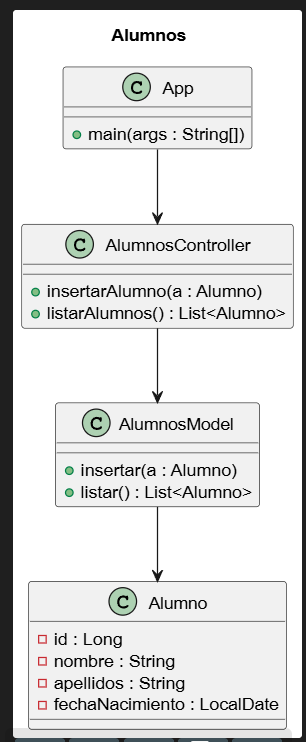

# Proyecto Alumnos

En esta aplicación de Java sirve para gestionar los datos de alumnos: nombre, apellidos y edad.  
El sistema permite insertar y listar alumnos desde una interfaz de consola.  

Este proyecto se ha desarrollado siguiendo un patrón de arquitectura el de Modelo - Vista - Controlador.

---

## Estructura del proyecto

### Funcionalidad

1.Insertar alumno: el usuario introduce nombre, apellidos y fecha de nacimiento.

2.Listar alumnos: muestra todos los alumnos guardados con su edad calculada.

3.Validación: no se permiten nombres o apellidos vacíos, ni fechas inválidas.

4.Duplicados: no se insertan dos alumnos con los mismos datos.

### Pruebas

Se han realizado dos tipos de pruebas:

-Pruebas unitarias con JUnit 5, ejecutando el repositorio real en memoria.

-Pruebas con Mockito, simulando el repositorio para comprobar llamadas y validaciones.

---

```plantuml

@startuml
title Alumnos 

class Alumno {
  - id : Long
  - nombre : String
  - apellidos : String
  - fechaNacimiento : LocalDate
}

class AlumnosModel {
  + insertar(a : Alumno)
  + listar() : List<Alumno>
}

class AlumnosController {
  + insertarAlumno(a : Alumno)
  + listarAlumnos() : List<Alumno>
}

class App {
  + main(args : String[])
}

App --> AlumnosController
AlumnosController --> AlumnosModel
AlumnosModel --> Alumno
@enduml

## Diagrama de clases



